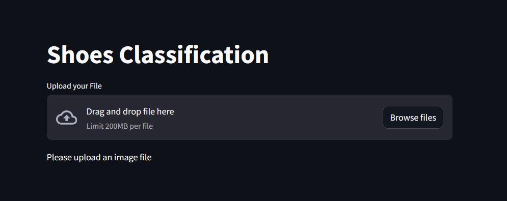
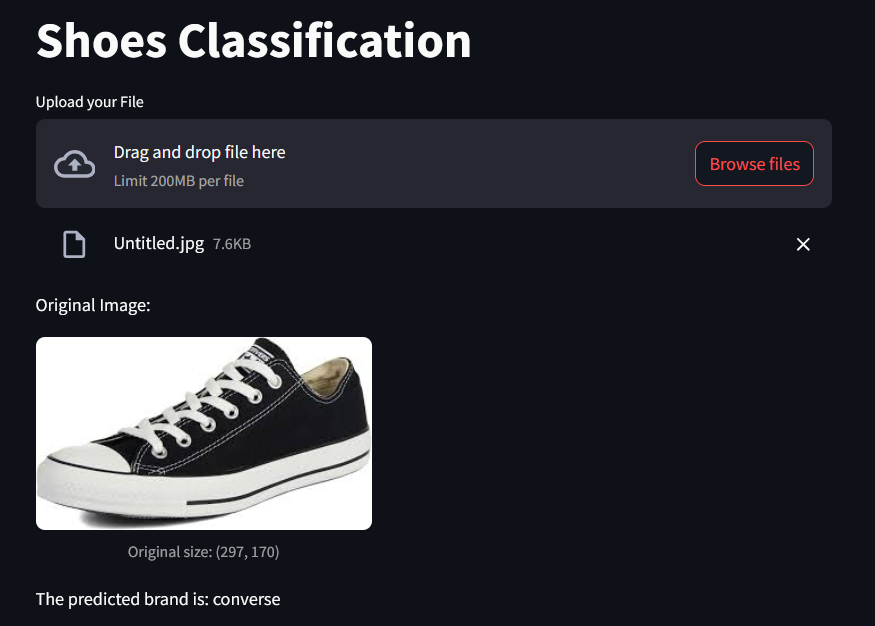

# Shoe Brand Image Classifier

This project is a simple web app for classifying shoe brands from images using a machine learning model (SVC). The app is built with Streamlit and uses a pre-trained model (`svc.pt`).

## Requirements
- Python 3.8+
- pip

### Python Packages
Install requirements with:
```bash
pip install streamlit pillow numpy pandas scikit-learn joblib
```

## Usage
1. Place your trained model file (`svc.pt`) in the project directory.
2. Run the Streamlit app:
   ```bash
   streamlit run shoes_classify.py
   ```
3. Open the provided local URL in your browser.
4. Upload a shoe image to get the predicted brand.

## Model Input Details
- The model expects images resized to **160x360 pixels** (width x height) in RGB format, flattened to a 1D array of 172800 features.
- Any uploaded image will be automatically converted and resized to this format before prediction.

## Data Preparation
- See `Shoes_data_prep.ipynb` for the data preparation and model training workflow.

## Troubleshooting
- For best results, upload clear images of shoes with similar orientation and background as the training data.

## License
[MIT](MIT)

## Result


#### Output
